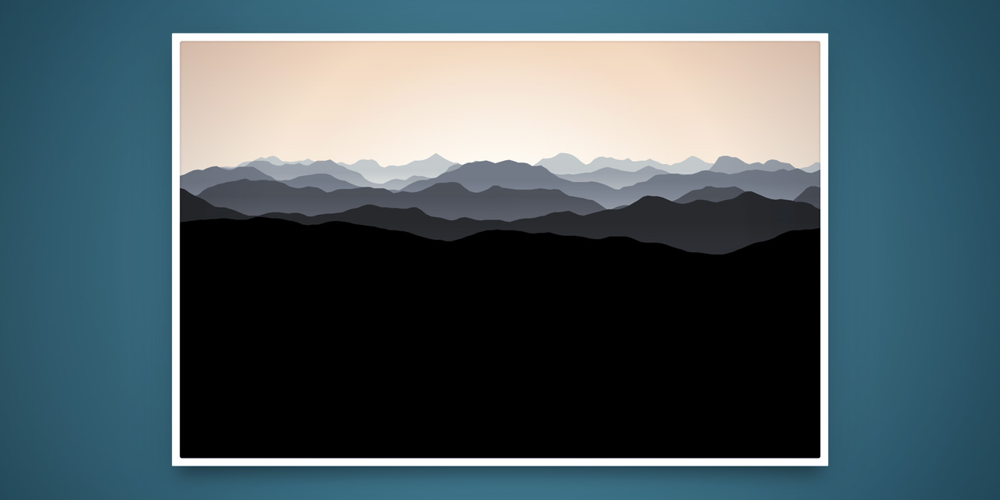

# ⛰️ mendiak &rsaquo; [mendiak.moro.es](https://mendiak.moro.es)

> **Basque Mountains Generator / Generador de Montes Vascos / Euskal Herriko Mendiak Sortzailea.**  
> [Basque Mountains](https://google.com/search?q=Euskal+Mendiak&tbm=isch) Landscape Wallpaper Images generation with Perlin Noise, SVG and JavaScript.  
> Built using: [Parcel](https://parceljs.org/), [SVG,js](https://svgjs.com/), [TinyColor](https://github.com/bgrins/TinyColor) and [Perlin Noise](https://www.npmjs.com/package/perlin-noise-3d). Deployment with [Netlify](https://www.netlify.com/)

[](https://mendiak.moro.es)

---

## Development

Clone or [download](https://github.com/alterebro/mendiak/archive/master.zip) the repository, install development dependencies and install Parcel if you already haven't.

```sh
$ git clone https://github.com/alterebro/mendiak.git
$ cd mendiak/
$ npm install
$ npm install -g parcel-bundler
```

### — Start Development Server

```sh
$ npm run dev
# $ parcel src/index.html
```

### — Build Project

```sh
$ npm run build
# $ rm -rf dist
# $ parcel build src/index.html --no-source-maps && cp -a src/static/. dist/
```

### — Serve built project (/dist files)

```sh
$ npm run serve
# $ npm run build
# $ ip=`ipconfig getifaddr en0`; php -S $ip:8000 -t dist/
```

### — Deploy (via Netlify)

No need for this: *Auto publishing is on. Deploys from master are published automatically*.

```sh
$ npm run deploy
# $ npm run build && netlify deploy --prod
```

---

*Jorge Moreno aka [Moro](https://moro.es) &mdash; [@alterebro](https://twitter.com/alterebro)*.
